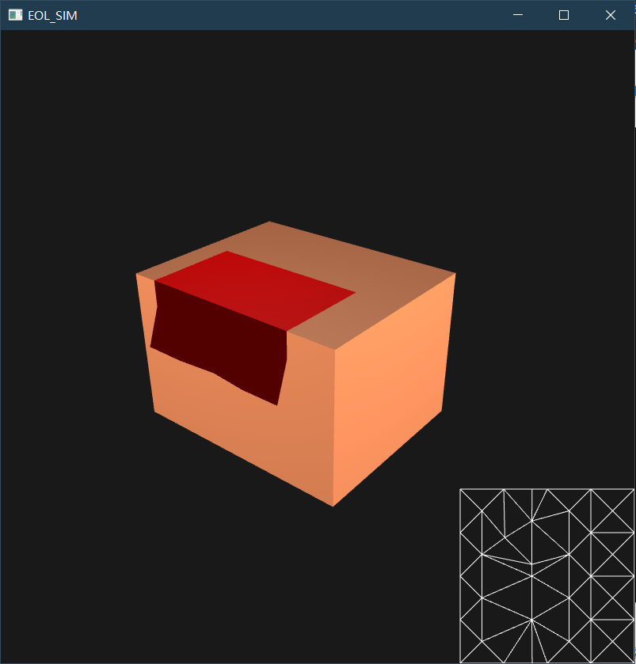

## Readme
Implementation of 'Eulerian-on-Lagrangian Cloth Simulation' on Siggraph 2018.

We referenced code on https://github.com/sueda/eol-cloth and fixed some bugs.

Final result:

### Installing
#### Dependencies
* GLM
* GLFW
* GLEW
* MOSEK
* Eigen
* ARCSIM

#### Building
I have put all the required external files in the "~/src/external/". You can put all the code files into Visual Studio and set the environment just originally.

PS: If you want to build the project yourself, you need to install the MOSEK! 
Here is the download link: https://www.mosek.com/downloads/. We recommend you to install Version 8, especially version 8.1.0. Because some APIs have changed between different versions. After installing MOSEK, you need to apply for an academic license. Here is the application link: https://www.mosek.com/products/academic-licenses/. Once you get the file 'mosek.lic', you need to change the path on your own computer in file "QuadProgMosek.cpp", line 216. (For you to run .exe in "~/exe/", we prepared a temporary license)

#### Running
Press "b" to play the animation.
Press "w" "a" "s" "d" to do camera roaming.
Move your mouse to rotate the view direction. 

#### Team Member
@[wkindling](https://github.com/wkindling)

@[Ripper](https://github.com/RipperJ) 
